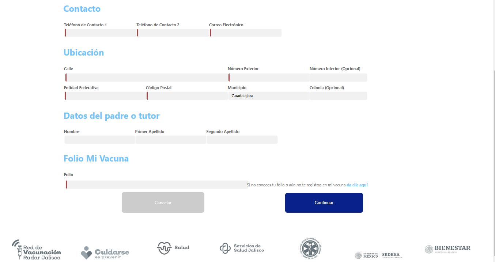

# Client

Este proyecto está generado con [Angular CLI](https://github.com/angular/angular-cli) versión 14.2.9.

Versión Node JS 16.13.0 y Npm versión 8.1.0.

## Development server

Ejecuta `ng serve` en una terminal en el directorio de la ruta del proyecto. Navega a `http://localhost:4200/`. La aplicación se recarga automáticamente al guardar los archivos del código fuente.

## Funcionamiento

### Página principal

En la página principal se muestra la cabecera que contiene los logos asignados junto con un pequeño menú con dos links, los cuales son solo estéticos.

Se cuenta con un botón flotante con un número de teléfono para realizar la llamada.

En la ventana principal primero encontramos las campañas que fueron agregadas directamente a la base de datos para el muestreo de la aplicación. Aquí se consume la API para la obtención de los registros de las campañas consumiendo mediante GET el recurso `/server-sonetasot/campanas.php`

Luego se encuentra la parte del formulario donde se ingresa la CURP para el registro o actualización, la cual está validada con una expresión regular. Solo se podrá acceder una vez se cumpla la validación.

EL pie de página contiene diferentes imágenes con las instituciones asignadas.

### Registro

Si la CURP no está registrada se redireccionará a la ventana donde se iniciará el registro.

En la primera ventana se encuentra la selección del municipio dentro de la ZMG en el que se vive, se muestran las opciones como lista desplegable, en la que se podrá elegir una de las opciones para poder avanzar a la siguiente pantalla.

La siguiente pantalla muestra el tipo de dosis a aplicar que se tienen registradas con ese municipio, en el cual se hace una validación con la base de datos para mostrar la dosis correspondiente. Se debe elegir la dosis habilitada para poder continuar a la siguiente pantalla.

Aquí mediante el método GET se consume el recurso `/server-sonetasot/campanas.php` para validar las campañas existentes en el municipio que se elija.

En esta pantalla se muestran las campañas correspondientes a la dosis seleccionada, se debe de elegir la campaña para poder pasar al siguiente paso.

Aquí mediante el método GET se consume el recurso `/server-sonetasot/campanas.php` para validar las campañas con el tipo de dosis que se elija.

Se llega a la ventana del registro de datos, donde se observan los campos ya añadidos de la CURP y el municipio, los cuales se obtienen de las opciones elegidas anteriormente, para solo rellenar los datos faltantes. En este caso se deben agregar los datos personales, ya que no se tiene acceso a estos desde la CURP. 

El folio solo es un dato que tampoco tiene forma de validación así que solo es un campo de tipo numérico que se agrega al registro, este campo es obligatorio.

Añadidos ya los campos obligatorios del formulario se puede crear el registro, en automático se pasan los campos del registro más el id de la campaña que se ha seleccionado anteriormente para crear la relación y obtener los datos de la campaña asignada.

Mediante el método POST se consume el recurso `/server-sonetasot/usuarios.php` para crear el nuevo registro a la base de datos en la tabla usuarios.

Creado el registro se redirecciona a una ventana con los datos de básicos como la CURP, el nombre y el folio del registro. Este folio es diferente al escrito anteriormente, ya que corresponde al ID del registro.

También se muestran los datos de la campaña que se ha asignado al registro y los datos del lugar y fecha de la aplicación de la vacuna.

Aquí mediante métodos GET se consumen los recursos `/server-sonetasot/campanas.php` y `/server-sonetasot/usuarios.php` para validar la campaña asignada y los datos del registro actual.

En esta ventana se tiene un botón con la opción de cancelar la cita, en el cual salta una ventana con la CURP y el folio asignados al registro.

Al pulsar el botón de *Cancelar mi cita* se eliminará el registro el cual está asignado a los datos mostrados. Aparecerá una ventana donde se confirma que se ha eliminado la cita y al dar en el botón *Finalizar* se redireccionará a la página principal.

Aquí mediante el método DELETE se consume el recurso `/server-sonetasot/usuarios.php` para eliminar el registro actual.

### Actualización

En el caso de que la CURP ya esté registrada se abre una ventana en la que se pueden actualizar los datos de ese registro, es una ventana similar a la de registro, pero en esta solo se podrán hacer actualizaciones de los datos del usuario.

Aquí mediante el método GET se consume el recurso `/server-sonetasot/usuarios.php` para traer el registro mediante el id correspondiente a la CURP ingresada, y con el método PUT se consume el mismo recurso para actualizar los datos del registro correspondiente.

Una vez actualizado el registro se abrirá una ventana de confirmación informando sobre la actualización, al dar en el botón *Finalizar* se redireccionará a la página principal.

